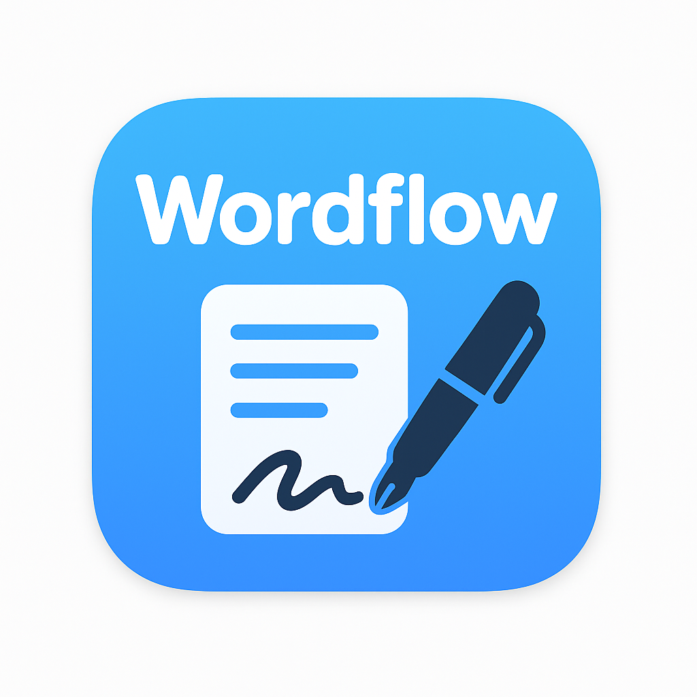

# IELTS Writing Practice App



**IELTS Writing練習・暗記支援特化macOSアプリケーション**

---

## 🎯 プロジェクト概要

IELTS Writing Practice Appは、IELTS受験者のWriting Task対策に特化したタイピング練習・暗記支援アプリケーションです。模範解答（約250語）の暗記・タイピング練習を通じて、WPM（Words Per Minute）向上と正確性向上を実現します。

### ビジョン
IELTS Writing Taskで高スコアを獲得するための実践的な練習環境を提供し、受験者の合格をサポートします。

### 対象ユーザー
- **プライマリ**: IELTS受験者（Writing Task 1&2対策）
- **セカンダリ**: 英語学習者（ライティングスキル向上）
- **ターシャリ**: 英語教師・講師（指導ツール）

### キーバリュー
- **IELTS特化設計**: Writing Task専用の練習機能
- **科学的測定**: WPM・正確性・品質指数の精密計測
- **効率的学習**: TTS音声 + 差分表示による暗記支援
- **詳細分析**: 文法・スペル等8分類のエラー分析

---

## ⚡ 主要機能

### 🎧 TTS音声システム
- **全文再生**: 模範解答の完全読み上げ（自然な発音）
- **文単位再生**: センテンスごとの個別再生
- **フレーズ再生**: 重要表現・フレーズの部分再生
- **速度調整**: 0.5x〜2.0x（IELTS Listening対策対応）
- **音声選択**: アメリカ英語・イギリス英語切り替え

### ⌨️ タイピング練習・測定
- **2分タイマー**: IELTS試験時間に対応した制限時間
- **リアルタイムWPM**: 入力速度の即時フィードバック表示
- **正確性測定**: 文字・単語・文レベルでの正答率計算
- **品質指数**: Accuracy × Speed の複合パフォーマンス指標
- **進捗表示**: 入力完了率のリアルタイム可視化

### 📊 詳細エラー分析
- **スペリング分析**: 誤字脱字の検出・分類
- **文法エラー検出**: 
  - 冠詞（a/an/the）の誤用
  - 三単現のs抜け・誤用
  - 複数形の誤用
  - 前置詞の誤選択
  - 時制の不一致
- **句読点分析**: カンマ・ピリオド・アポストロフィー等
- **大文字化**: 固有名詞・文頭・略語の大文字化ルール
- **分析ON/OFF**: カテゴリ別の有効/無効切り替え機能

### 🔍 差分ハイライト表示
- **リアルタイム差分**: 入力と目標文の即時比較表示
- **エラー種別色分け**: 各エラータイプごとの色分類
- **正解部分強調**: 正しく入力された部分の緑色表示
- **未入力部分**: 残りの入力必要箇所のグレー表示

### 📝 復習リストシステム
- **間違い箇所自動抽出**: エラー発生部分の自動収集
- **エラー種別分類**: 文法・スペル等での分類表示
- **TTS統合**: 復習項目の音声再生機能
- **習得度管理**: 繰り返し練習による習得レベル追跡
- **優先度表示**: 頻出エラーの優先的表示

### 📈 学習データ管理
- **CSV/JSONエクスポート**: 学習履歴の詳細データ出力
- **進捗比較**: 時系列でのパフォーマンス改善追跡
- **統計分析**: WPM・Accuracy・エラー分類の詳細統計

---

## 🛠️ 技術仕様

### コア技術スタック
- **プラットフォーム**: macOS 14.0+ (Sonoma)
- **開発言語**: Swift 5.9+
- **UIフレームワーク**: SwiftUI
- **音声システム**: AVFoundation (AVSpeechSynthesizer)
- **データ管理**: Core Data / SwiftData
- **アーキテクチャ**: MVVM + Repository Pattern

### パフォーマンス要件
- **入力遅延**: 50ms以内（リアルタイム応答）
- **TTS応答**: 500ms以内（音声再生開始）
- **差分計算**: 100ms以内（リアルタイム表示）
- **データ処理**: 10ms以内（WPM・正確性計算）

### システム要件
- **最小要件**: macOS 14.0 (Sonoma)
- **推奨要件**: macOS 15.0+ (Sequoia)  
- **アーキテクチャ**: Intel & Apple Silicon対応
- **メモリ**: 4GB以上推奨
- **ストレージ**: 100MB以上

---

## 🏗️ システム設計

### アーキテクチャ概要
```
┌─────────────────────────────────────────┐
│         IELTS Practice App              │
├─────────────────────────────────────────┤
│ SwiftUI Presentation Layer              │
│ ├─ TypingPracticeView                   │
│ ├─ TTSControlView                       │
│ ├─ ErrorAnalysisView                    │
│ ├─ ReviewListView                       │
│ └─ SettingsView                         │
├─────────────────────────────────────────┤
│ Business Logic Layer (MVVM)             │
│ ├─ TypingTestManager                    │
│ ├─ TTSManager                           │
│ ├─ ErrorAnalyzer                        │
│ ├─ DifferenceHighlighter                │
│ └─ ReviewManager                        │
├─────────────────────────────────────────┤
│ Data Layer (Repository Pattern)         │
│ ├─ IELTSTaskRepository                  │
│ ├─ TypingResultRepository               │
│ ├─ ReviewItemRepository                 │
│ └─ SettingsRepository                   │
├─────────────────────────────────────────┤
│ Persistence Layer                       │
│ ├─ Core Data Models                     │
│ ├─ CSV/JSON Export                      │
│ └─ User Defaults                        │
└─────────────────────────────────────────┘
```

### データモデル設計
- **IELTSTask**: 模範解答・トピック・難易度・Band Score
- **TypingResult**: テスト結果・WPM・正確性・品質指数・エラー詳細
- **ReviewItem**: 復習項目・エラー種別・習得レベル・優先度
- **ErrorResult**: エラー詳細・位置・種別・修正提案

### UI/UX設計（練習特化）
```
┌─────────────────────────────────────────┐
│              Main Practice View          │
├─────────────────┬───────────────────────┤
│   Target Text   │    Input Area         │
│   (模範解答)      │   (入力エリア)         │
│   250 words     │   + Real-time         │
│   + TTS control │   + Difference        │
│   + Highlight   │   + Auto-scroll       │
├─────────────────┴───────────────────────┤
│           Statistics Panel              │
│ ⏱️ 1:23 | 📊 45 WPM | 🎯 92% | 🏆 0.85   │
│ Timer | Current WPM | Accuracy | Quality │
├─────────────────────────────────────────┤
│              Error Analysis             │
│ 🔴 Spelling: 3 | 🟠 Grammar: 2 | 🔵 Punct: 1│
└─────────────────────────────────────────┘
```

---

## 🎯 詳細機能仕様

### TTS制御システム
```swift
// TTS管理クラス
class TTSManager: NSObject, AVSpeechSynthesizerDelegate {
    private let synthesizer = AVSpeechSynthesizer()
    private var currentVoice: AVSpeechSynthesisVoice?
    
    // 基本再生機能
    func playFullText(_ text: String, speed: Float = 1.0)
    func playSentence(at index: Int, speed: Float = 1.0)
    func playPhrase(_ phrase: String, speed: Float = 1.0)
    
    // 制御機能
    func pauseSpeech()
    func resumeSpeech()
    func stopSpeech()
    
    // 設定機能
    func setVoiceLanguage(_ language: VoiceLanguage)
    func setSpeed(_ speed: Float) // 0.5-2.0
}
```

### タイピング測定エンジン
```swift
// タイピングテスト管理
@Observable
class TypingTestManager {
    // テスト状態
    private(set) var isActive: Bool = false
    private(set) var remainingTime: TimeInterval = 120
    private(set) var currentWPM: Double = 0
    private(set) var accuracy: Double = 0
    private(set) var qualityIndex: Double = 0
    
    // テスト制御
    func startTest(with target: String)
    func updateInput(_ input: String)
    func pauseTest()
    func resumeTest()
    func endTest() -> TypingResult
    
    // リアルタイム計算
    private func calculateWPM() -> Double
    private func calculateAccuracy() -> Double
    private func calculateQualityIndex() -> Double
}
```

### エラー分析システム
```swift
// エラー分析エンジン
struct ErrorAnalyzer {
    enum ErrorType: CaseIterable {
        case spelling      // スペルエラー
        case article       // 冠詞 (a/an/the)
        case thirdPerson   // 三単現のs
        case plural        // 複数形
        case preposition   // 前置詞
        case tense         // 時制
        case punctuation   // 句読点
        case capitalization // 大文字化
    }
    
    struct ErrorResult {
        let type: ErrorType
        let position: Range<String.Index>
        let expected: String
        let actual: String
        let suggestion: String
    }
    
    func analyzeText(_ input: String, target: String) -> [ErrorResult]
}
```

---

## 🚀 開発計画

### Phase 1: Core IELTS機能 (8週間)
**Critical Priority - IELTS特化基盤**

#### Week 1-2: データモデル・アーキテクチャ
- [ ] IELTSTask, TypingResult, ReviewItem Core Dataモデル
- [ ] Repository Pattern実装
- [ ] MVVM基盤構築

#### Week 3-4: タイピング測定エンジン
- [ ] TypingTestManager実装
- [ ] リアルタイムWPM・Accuracy計算
- [ ] 2分タイマー・品質指数算出
- [ ] パフォーマンス最適化（<50ms遅延）

#### Week 5-6: メインUI実装
- [ ] TypingPracticeView（左:目標文、右:入力、下:統計）
- [ ] リアルタイム統計表示
- [ ] プログレスバー・タイマー表示
- [ ] レスポンシブレイアウト

#### Week 7-8: 基本統合・テスト
- [ ] エンドツーエンドテスト
- [ ] パフォーマンステスト
- [ ] データ永続化検証

### Phase 2: TTS・エラー分析 (6週間)
**Critical Priority - 学習支援機能**

#### Week 9-10: TTS音声システム
- [ ] AVFoundation統合・TTSManager実装
- [ ] 全文・文・フレーズ再生機能
- [ ] 音声制御UI（再生・停止・速度・言語）
- [ ] 音声品質最適化

#### Week 11-12: エラー分析エンジン
- [ ] 8種類エラー分類アルゴリズム実装
- [ ] リアルタイムエラー検出
- [ ] エラー設定画面（ON/OFF切り替え）
- [ ] 分析精度調整

#### Week 13-14: 差分ハイライトシステム
- [ ] リアルタイム差分計算・表示
- [ ] エラー種別色分けUI
- [ ] パフォーマンス最適化（大文字数対応）

### Phase 3: 学習支援・データ出力 (4週間)
**High Priority - 復習・分析機能**

#### Week 15-16: 復習システム
- [ ] ReviewManager・復習リスト生成
- [ ] 習得度追跡・優先度管理
- [ ] TTS統合復習機能

#### Week 17-18: データ出力・完成
- [ ] CSV/JSONエクスポート機能
- [ ] 学習履歴分析・可視化
- [ ] 最終統合テスト・リリース準備

---

## ⚙️ パフォーマンス・品質要件

### パフォーマンス目標
- **起動時間**: 2秒以内
- **入力遅延**: 50ms以内（リアルタイム応答必須）
- **TTS応答**: 500ms以内（音声再生開始）
- **差分計算**: 100ms以内（250語テキスト）
- **メモリ使用量**: 150MB未満

### 品質基準
- **安定性**: クラッシュ率 < 0.01%
- **測定精度**: WPM誤差 < 2%, Accuracy誤差 < 1%
- **データ完全性**: 100%（学習データ損失なし）
- **テストカバレッジ**: ≥85% (単体), ≥75% (統合)

### IELTS対応要件
- **Task 1対応**: 150語目標の文章（グラフ・チャート説明）
- **Task 2対応**: 250語目標の文章（エッセイ・論文）
- **Band Score対応**: 6.0-9.0レベル別の模範解答
- **制限時間**: Task 1: 20分, Task 2: 40分（練習は2分単位）

---

## 🔒 セキュリティ・プライバシー

### データ保護
- **完全ローカル処理**: 全データはローカル保存（プライバシー保護）
- **学習データ暗号化**: Core Data暗号化ストレージ
- **App Sandbox**: macOS標準セキュリティ準拠
- **自動バックアップ**: 定期的なデータバックアップ

### プライバシー設計
- **オフライン動作**: インターネット接続不要
- **データ収集なし**: 個人情報・学習データの外部送信なし
- **透明性**: データ使用方法の明確な説明
- **ユーザー制御**: データ削除・エクスポート機能

---

## 📦 配布・リリース

### リリース形態
- **直接配布**: DMGパッケージ（公証済み）
- **Mac App Store**: メイン配布チャネル
- **教育機関向け**: ボリュームライセンス対応

### 対応ファイル形式
- **インポート**: TXT, CSV（模範解答一括登録）
- **エクスポート**: CSV, JSON（学習データ詳細）
- **バックアップ**: 独自形式（完全データ復元）

---

## 🔮 将来拡張計画

### 短期拡張 (6ヶ月以内)
- **Speaking Practice**: IELTS Speaking対応
- **模範解答拡充**: より多様なトピック・Band Score
- **カスタム問題**: ユーザー独自の練習文章作成

### 中期拡張 (1年以内)
- **iOS版**: iPad対応（タブレット学習）
- **AI分析**: より高度な文法・表現分析
- **クラウド同期**: デバイス間学習データ同期

### 長期ビジョン (2年以内)
- **IELTS全技能対応**: Reading, Listening統合
- **オンライン教材連携**: 公式・非公式教材統合
- **教師向け機能**: 進捗管理・分析ダッシュボード

---

## 📋 IELTS特化要件

### Writing Task 1 対応
- **グラフ・チャート説明**: 数値データの説明練習
- **150語目標**: Task 1特有の短文練習
- **定型表現**: データ説明用フレーズ・語彙
- **構造練習**: Introduction-Overview-Details構成

### Writing Task 2 対応  
- **エッセイ構成**: Introduction-Body-Conclusion
- **250語目標**: 標準的なエッセイ長さ
- **論理展開**: 意見・根拠・例示の練習
- **高度語彙**: Band 7+レベルの表現練習

### Band Score対応
- **Band 6.0**: 基本的な文章構成・語彙
- **Band 7.0**: より自然な表現・複雑な構文
- **Band 8.0**: 高度な語彙・洗練された表現
- **Band 9.0**: ネイティブレベルの流暢さ

---

## 🤝 開発方針・品質管理

### 開発方針
- **IELTS-First Design**: IELTS受験者ニーズを最優先
- **Performance-Critical**: リアルタイム処理の最適化
- **Data-Driven**: 学習効果の測定・改善
- **User-Centered**: 実際の受験者フィードバック重視

### 品質保証
- **実機テスト**: 各macOSバージョンでの動作確認
- **ユーザビリティテスト**: IELTS受験者による実証テスト
- **パフォーマンステスト**: 継続的な応答性能監視
- **正確性検証**: WPM・Accuracy計算の精度検証

---

## 📞 サポート・ライセンス

### 技術サポート
- **ドキュメント**: 包括的なユーザーマニュアル
- **FAQ**: よくある質問・トラブルシューティング
- **アップデート**: 定期的な機能改善・バグ修正

### ライセンス
- **商用ライセンス**: 教育機関・個人利用
- **オープンソース**: コア機能の一部公開予定
- **プライバシー**: GDPR・個人情報保護法準拠

---

## 📊 開発統計

**作成日**: 2025-08-10  
**仕様策定期間**: 1日  
**予想開発期間**: 18週間（4.5ヶ月）  
**開発工数**: 920時間  
**対象市場**: IELTS受験者（年間300万人+）  
**競合優位性**: IELTS Writing特化（市場初）  

---

*本仕様書は、IELTS受験者の実際のニーズ分析と技術的実現可能性を基に作成された、IELTS Writing Practice App開発のための包括的な技術文書です。従来の汎用文書管理アプリとは完全に異なる、IELTS特化型学習支援アプリケーションの開発を実現します。*